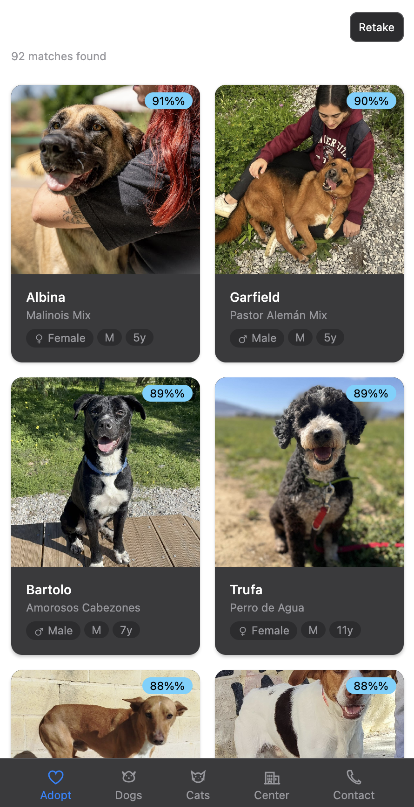
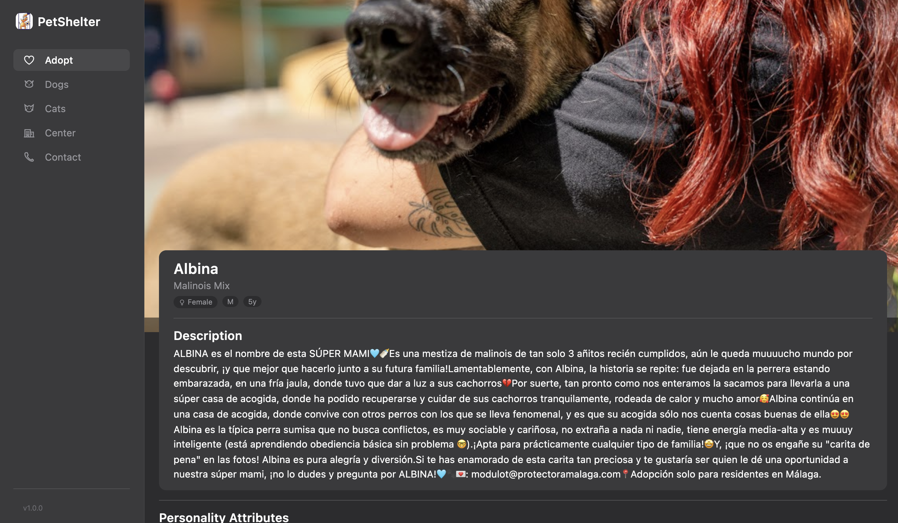

<p align="center">
  
</p>

<h1 align="center">🐾 PetShelter KMP</h1>

<p align="center">
  <strong>A free, open-source app for animal shelters — ready to fork, customize, and deploy.</strong><br/>
  Built with ❤️ for the animals who deserve a second chance.
</p>

<p align="center">
  📱 Android &nbsp;·&nbsp; 🍎 iOS &nbsp;·&nbsp; 🖥️ Desktop &nbsp;·&nbsp; 🌐 Web
</p>

---

## 🐶 What is PetShelter?

PetShelter is a **Kotlin Multiplatform** application that helps animal shelters showcase their animals to potential adopters. From a single codebase, it generates native apps for **Android**, **iOS**, **Desktop**, and **Web** — so your shelter can reach families everywhere.

🔍 Browse animals with filters · 🖼️ Photo carousels with fullscreen view · 🎬 YouTube video integration · 🌙 Dark & light themes · 🌍 8 languages included

---

## 📸 Screenshots

<p align="center">
  <br/>
  <em>Browse all animals with smart filters — desktop dark mode</em>
</p>

<p align="center">
  &nbsp;&nbsp;&nbsp;&nbsp;
  <br/>
  <em>Mobile light mode — animal grid &amp; questionnaire match results</em>
</p>

<p align="center">
  <br/>
  <br/>
  <em>Animal detail page with photo carousel, personality attributes &amp; adopt button</em>
</p>

---

## 🆓 Free for Animal Shelters

This project is **completely free** for any animal shelter, rescue organization, or animal welfare group to use. 🎉

> **🍴 Fork it. ✏️ Customize it. 🚀 Deploy it.**
>
> Whether you need a website, a mobile app, or both — PetShelter gives you a head start. Swap in your own animals, branding, and contact info, and you're ready to help animals find their forever homes. 🏡

No licensing fees. No strings attached. Just a tool built to help animals in need. 🐕🐈

---

## ✨ Features

| Feature | Description |
|---------|-------------|
| 🐕 **Dog & Cat Listings** | Browse all animals available for adoption with photos and details |
| 🔎 **Smart Filters** | Filter by sex, size, breed, and age to find the perfect match |
| 🖼️ **Image Carousels** | Swipe through multiple photos per animal with fullscreen viewing |
| 🎬 **Video Support** | Embedded YouTube video thumbnails with one-tap playback |
| 📊 **Personality Attributes** | Visual scores for friendliness, energy, trainability, and more |
| 🏢 **Shelter Info Page** | Showcase your organization, visiting hours, and services |
| 📞 **Contact Page** | Direct contact details and social media links |
| 🌙 **Dark & Light Mode** | Automatic theme switching based on system preferences |
| 🌍 **8 Languages** | English, Spanish, French, German, Italian, Portuguese, Dutch, and Polish |
| 📱 **Responsive Design** | Sidebar navigation on large screens, bottom tabs on mobile |

---

## 📱 Supported Platforms

| Platform | Target | Status |
|----------|--------|--------|
| 🤖 Android | Phone & Tablet | ✅ Supported |
| 🍎 iOS | iPhone & iPad | ✅ Supported |
| 🖥️ Desktop | macOS, Windows, Linux (JVM) | ✅ Supported |
| 🌐 JavaScript | Modern & legacy browsers | ✅ Supported |
| ⚡ WebAssembly | Modern browsers (Wasm) | ✅ Supported |

---

## 🏗️ Project Structure

```
PetShelterKMP/
├── 📁 androidApp/              Android application module
├── 📁 composeApp/              Shared KMP library (all platforms)
│   └── src/
│       ├── 📁 commonMain/         Shared Compose UI and business logic
│       ├── 📁 androidMain/        Android platform-specific code
│       ├── 📁 iosMain/            iOS UIViewController bridge
│       ├── 📁 jvmMain/            Desktop entry point
│       ├── 📁 jsMain/             JavaScript platform code
│       ├── 📁 wasmJsMain/         WebAssembly platform code
│       └── 📁 webMain/            Shared web entry point (JS + Wasm)
└── 📁 iosApp/                  iOS application (Xcode project)
```

---

## 🚀 Getting Started

### Prerequisites

- ☕ **JDK 17** or later
- 🛠️ **IntelliJ IDEA** (2024.1+) or **Android Studio** (Ladybug+) with the [Kotlin Multiplatform plugin](https://plugins.jetbrains.com/plugin/14936-kotlin-multiplatform)
- 🍏 **Xcode 16+** (for iOS development on macOS)
- 📦 **Android SDK** with API 36 installed

### Build & Run

```bash
# 🖥️ Desktop
./gradlew :composeApp:run

# 🤖 Android
./gradlew :androidApp:assembleDebug

# 🌐 Web (JavaScript)
./gradlew :composeApp:jsBrowserDevelopmentRun

# ⚡ Web (WebAssembly)
./gradlew :composeApp:wasmJsBrowserDevelopmentRun
```

For 🍎 iOS, open `iosApp/iosApp.xcodeproj` in Xcode and run on a simulator or device.

---

## 🍴 How to Make It Yours

1. **Fork** this repository
2. **Replace the animal data** in `composeApp/src/commonMain/composeResources/files/studied_animals.json` with your shelter's animals
3. **Update branding** — swap the app icon, colors in the design system, and shelter info
4. **Edit translations** in `composeApp/src/commonMain/composeResources/values*/strings.xml` to match your organization
5. **Deploy** to the platforms you need — publish to Google Play, the App Store, or host the web version on any static server 🎉

---

## 🧱 Architecture

The project follows **Clean Architecture + MVVM** with all shared code under the `com.petshelter` package.

| Pattern | Details |
|---------|---------|
| 📊 **State Management** | ViewModels expose `StateFlow<UiState>` collected via `collectAsState()` |
| 💉 **Dependency Injection** | [Koin](https://insert-koin.io/) with `single {}`, `factory {}`, and `viewModel {}` |
| 🧭 **Navigation** | Type-safe `@Serializable` route definitions with `NavHost` composable DSL |
| 🔌 **Platform Abstraction** | Kotlin `expect`/`actual` for platform-specific code |
| 🎨 **Design System** | `PetShelterTheme`, `PetShelterTypography`, `Spacing`, `Radii` |

---

## 📦 Key Dependencies

| Dependency | Version |
|-----------|---------|
| Kotlin | 2.3.0 |
| Compose Multiplatform | 1.10.0 |
| Gradle | 8.14.3 |
| Coil 3 | 3.1.0 |
| Ktor | 3.1.3 |
| Koin | 4.1.1 |
| Android compileSdk | 36 |
| Android minSdk | 24 |
| iOS deployment target | 18.2 |

---

## 🤝 Contributing

Contributions are welcome! Whether you're fixing a bug 🐛, adding a feature ✨, improving translations 🌍, or just cleaning up code 🧹 — every bit helps the animals.

---

## 📄 License

This project is free to use for any animal shelter or rescue organization. Fork it, modify it, and make it your own. 🐾

---

<p align="center">
  Made with ❤️ for every animal waiting for a home 🏡<br/>
  Built with <strong>Kotlin Multiplatform</strong> and <strong>Compose Multiplatform</strong>
</p>
